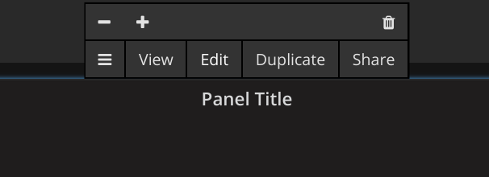

:imagesdir: images
:!figure-caption:
[[panel-configuration-panel-comfig]]
= Panel Configuration
:toc: macro
:toc-title:
:data-uri:
:prewrap!:

toc::[]

== Overview

{product-title} enables robust customization of dashboard panels, from updating appearance and general information to configuring complex filters. 
Panel configuration is available in the bottom half of a panel in editing mode:

The types of configuration options available depend on the type of datasoource associated with the panel. 

This section describes how to do the following:

* xref:pc-forecasting[use filters to forecast metrics]

[[pc-forecasting]]
== Using Filters to Forecast Metrics

OpenNMS includes several pre-defined filters, that {product-title} can use to display forecast metrics in a panel. 
Adding a forecast filter can help you anticipate when you might need to make changes to your network depending, for example, on anticipated bandwidth usage, disk space capacity, network traffic, and so on. 

To use filters to forecast metrics, follow these steps:

. Open the panel where you want to create a filter. 
.. This panel should be using a xref:../datasources/performance_datasource.adoc#[performance datasource]. 
. Click *Add Query*. 
. In the *Type* drop-down, choose *Filter*.
. Click the Filter type label, select `HoltWinters` from the pop-up screen, and click *Select*.
.. Note that the far right column displays requirements on the node being queried, e.g., R, Java. 
. For the Input column, specify *In* [why?].
. [What to specify in Output]?
. Specify the number of periods to forecast, the size of the period in seconds, and the desired probability in the appropriate fields. 
.. Note that the size of period should match the seasonality of the data (i.e., you may not want weekend network usage to be included in a forecast of usage during regular business hours). 
. If you have noisy or spiky data, forecasting does not work as well. You should also the Chomp and Outlier filters, and move them so that they appear before the HoltWinters filter in the list of queries.
. Save the dashboard. 
. In the upper right menu, change the time range, as desired. 

[TIP]
====
The time range you select should be logical for the number of periods and period size specified in your filter. 
As a guideline, you need at least three times the period to get historical data for a forecast. 
====

